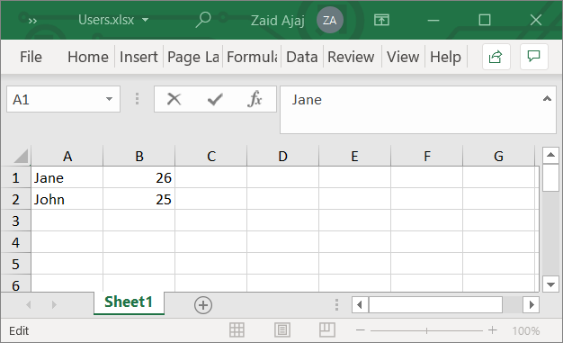
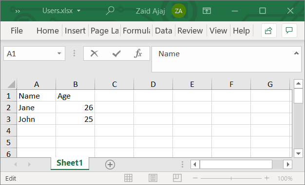
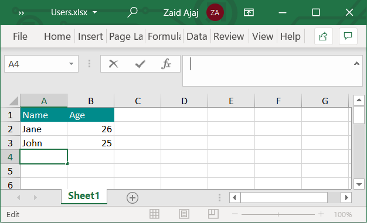
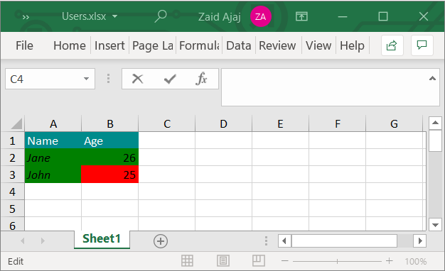
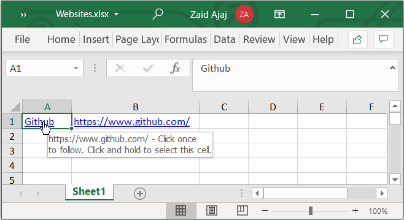
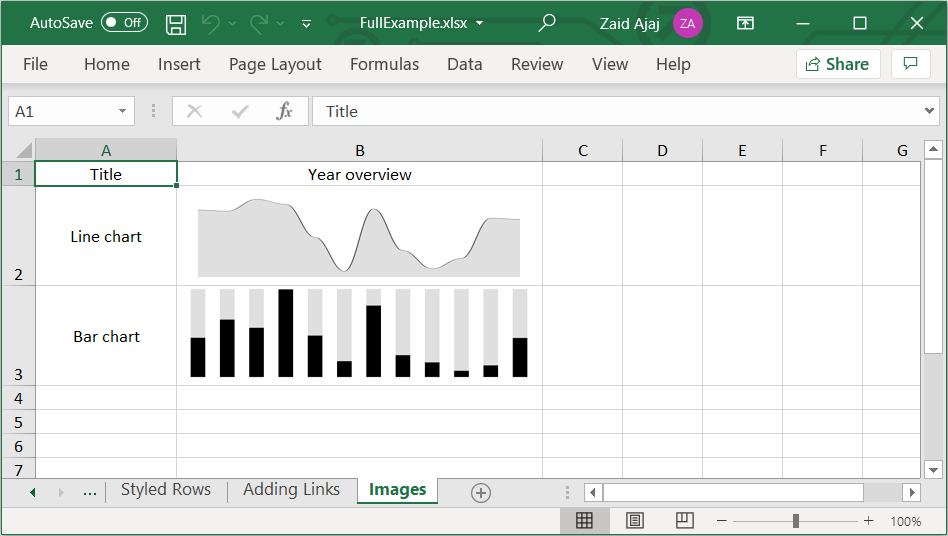

# ClosedXML.SimpleSheets

[](https://www.nuget.org/packages/ClosedXML.SimpleSheets)

A library to easily generate Excel sheets from data in F#. Built on top of [ClosedXML](https://github.com/ClosedXML/ClosedXML)

### Install
```
dotnet add package ClosedXML.SimpleSheets
```
Now you can use it inside your project. Here are examples of how to use it

### Generate a sheet from data
```fs
open ClosedXML.SimpleSheets

type User = { Name: string; Age: int }

let users = [
    { Name = "Jane"; Age = 26 }
    { Name = "John"; Age = 25 }
]

let excelFile = Excel.createFrom(users, [
    Excel.field(fun user -> user.Name)
    Excel.field(fun user -> user.Age)
])

System.IO.File.WriteAllBytes("Users.xlsx", excelFile)
```
This generated an Excel file that looks like this. The function `Excel.createFrom` returns a `byte[]` that represents the contents of the Excel file.



### Add headers to the fields
```fs
open ClosedXML.SimpleSheets

type User = { Name: string; Age: int }

let users = [
    { Name = "Jane"; Age = 26 }
    { Name = "John"; Age = 25 }
]

let excelFile = Excel.createFrom(users, [
    Excel.field(fun user -> user.Name).header("Name")
    Excel.field(fun user -> user.Age).header("Age")
])

System.IO.File.WriteAllBytes("Users.xlsx", excelFile)
```
> When one or more fields have a header, the header row is added. Missing header names from other fields is fine and they will be added as empty cells.



### Improved type-inference of the fields

Most of the time when using the `Excel.field(...)` function, the underlying types of the lambda will be properly inferred. However, there are cases where there are many types _opened_ in the scope that hinders type inference and you would have to help the compiler by writing the types yourself:
```fs
let excelFile = Excel.createFrom(users, [
    Excel.field(fun (user: User) -> user.Name).header("Name")
    Excel.field(fun (user: User) -> user.Age).header("Age")
])
```
To improve the situation, this library adds _extension methods_ that allow you **omit** the types from the lambda as follows:
```fs
let excelFile = Excel.createFrom(users, [
    users.excelField(fun user -> user.Name).header("Name")
    users.excelField(fun user -> user.Age).header("Age")
])
```

### Customize header cells
```fs
open ClosedXML
open ClosedXML.Excel
open ClosedXML.SimpleSheets

type User = { Name: string; Age: int }

let users = [
    { Name = "Jane"; Age = 26 }
    { Name = "John"; Age = 25 }
]

let excelFile = Excel.createFrom(users, [
    Excel.field(fun user -> user.Name)
        .header("Name")
        .headerBackgroundColor(XLColor.DarkCyan)
        .headerFontColor(XLColor.White)

    Excel.field(fun user -> user.Age)
        .header("Age")
        .headerBackgroundColor(XLColor.DarkCyan)
        .headerFontColor(XLColor.White)
])

System.IO.File.WriteAllBytes("Users.xlsx", excelFile)
```


### Customize field cells
```fs
open ClosedXML
open ClosedXML.Excel
open ClosedXML.SimpleSheets

type User = { Name: string; Age: int }

let users = [
    { Name = "Jane"; Age = 26 }
    { Name = "John"; Age = 25 }
]

let excelFile = Excel.createFrom(users, [
    Excel.field(fun user -> user.Name)
        .header("Name")
        .headerBackgroundColor(XLColor.DarkCyan)
        .headerFontColor(XLColor.White)
        .backgrouncColor(XLColor.Green)
        .italic()

    Excel.field(fun user -> user.Age)
        .header("Age")
        .headerBackgroundColor(XLColor.DarkCyan)
        .headerFontColor(XLColor.White)
        .backgroundColor(fun user ->
            if user.Name = "Jane"
            then XLColor.Green
            else XLColor.Red
        )
])

System.IO.File.WriteAllBytes("Users.xlsx", excelFile)
```
> Notice how the `backgroundColor` function has two overloads. One that takes the color as a value where each cell applies that color. Another overload *computes* the color based on the current row.



### Change the sheet name

The name "Sheet1" is the default, you can change that simply by providing the name of the sheet as the first parameter:
```fs
let excelFile = Excel.createFrom("Users", users, [
    Excel.field(fun user -> user.Name)
    Excel.field(fun user -> user.Age)
])
```

### Create multiple sheets in a single Excel file

The simple overload of the `Excel.createFrom` function generates a single Excel *workbook* that contains a single *worksheet* and returns a contents as byte array. To create multiple sheets, we fallback to the API from `ClosedXML` to create the workbook and use `Excel.populate` to fill sheets of the workbook as follows:
```fs
open ClosedXML
open ClosedXML.Excel
open ClosedXML.SimpleSheets

type User = { Name: string; Age: int; Active: bool }

let users = [
    { Name = "Zaid"; Age = 24; Active = true }
    { Name = "Jane"; Age = 26; Active = false }
    { Name = "John"; Age = 25; Active = false }
]

let multipleSheets() : byte[] =
    use workbook = new XLWorkbook()
    let simpleFields = workbook.AddWorksheet("Simple Fields")
    Excel.populate(simpleFields, users, [
        Excel.field(fun user -> user.Name)
        Excel.field(fun user -> user.Age)
        Excel.field(fun user -> user.Active)
    ])

    let fieldsWithHeaders = workbook.AddWorksheet("Added Headers")
    Excel.populate(fieldsWithHeaders, users, [
        Excel.field(fun user -> user.Name).header("Name")
        Excel.field(fun user -> user.Age).header("Age")
        Excel.field(fun user -> user.Active).header("Active")
    ])

    Excel.createFrom(workbook)

System.IO.File.WriteAllBytes("MultipleSheets.xlsx", multipleSheets())
```

### Using hyperlinks
```fs
type Website = { name: string; address: string }

let websites = [
    { name = "Github"; address = "https://www.github.com" }
]

let excelFile = Excel.createFrom(websites, [
    // named link
    Excel.field(fun website -> website.name).hyperlink(fun website -> Uri(website.address))
    // full link
    Excel.field(fun website -> Uri(website.address))
])

System.IO.File.WriteAllBytes("Websites.xlsx", excelFile)
```


### Header and Cell alignments
```fs
open ClosedXML
open ClosedXML.Excel
open ClosedXML.SimpleSheets

type User = { Name: string; Age: int }

let users = [
    { Name = "Jane"; Age = 26 }
    { Name = "John"; Age = 25 }
]

let excelFile = Excel.createFrom(users, [
    Excel.field(fun user -> user.Name)
        .header("Name")
        // header name is centered, horizontally
        .headerHorizontalAlignment(XLAlignmentHorizontalValues.Center)
        // cell values are centered, both in vertical and horizontal direction
        .verticalAlignment(XLAlignmentVerticalValues.Center)
        .horizontalAlignment(XLAlignmentHorizontalValues.Center)
])

System.File.IO.WriteAllBytes("Alignments.xlsx", excelFile)
```
Alternatively, you can just say
```fs
Excel.field(fun user -> user.Name)
    .header("Name")
    .headerCentered()
    .centered()
```
Which will have the same effect. These are short-hand functions

### Working with Images
You can map fields into images using the `XLImage` type which can be constructed using the contents of an image as `byte[]` and its format:
```fs
open ClosedXML.SimpleSheets
open ClosedXML.Excel.Drawings

Excel.field(fun user -> XLImage(user.profileImageBytes, XLPictureFormat.Png))
```
The image added to the workbook will be resized to the size of the cell to which it was added. You can play with the column width and row height to make the images more visible:
```fs
open ClosedXML.SimpleSheets
open ClosedXML.Excel.Drawings

Excel.field(fun user -> XLImage(user.profileImageBytes, XLPictureFormat.Png))
     .columnWidth(40)
     .rowHeight(50)
```
Bonus points if you are using a charting library that can export the charts as image bytes. See the project in  `./test` where we generate charts for row data and generate images from them using the [Microcharts](https://github.com/dotnet-ad/Microcharts) library. You can use other charting libraries as well if they are able to export charts as `byte[]`:

